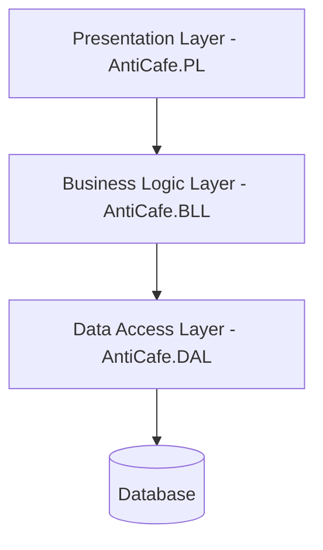
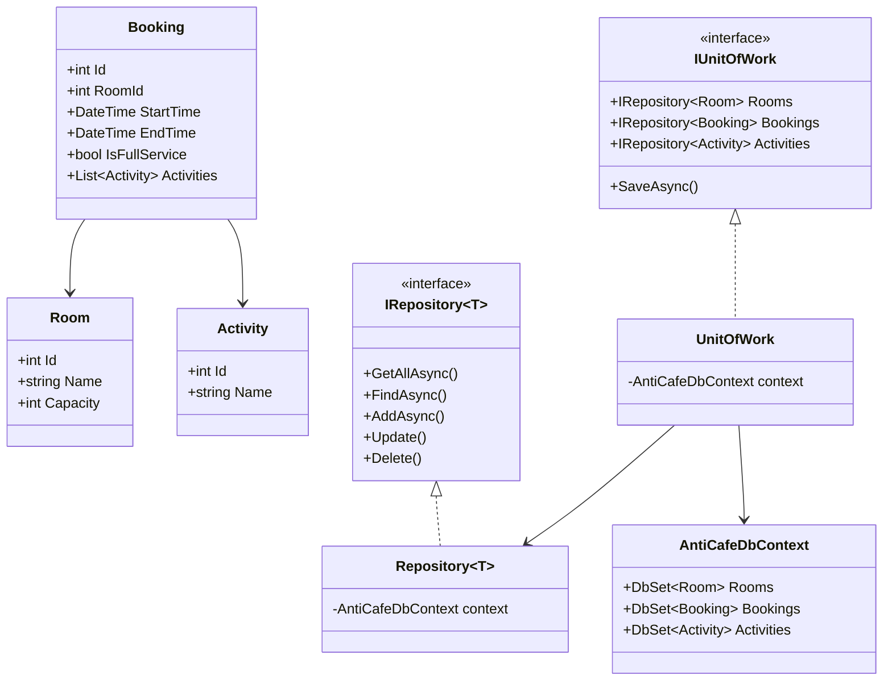
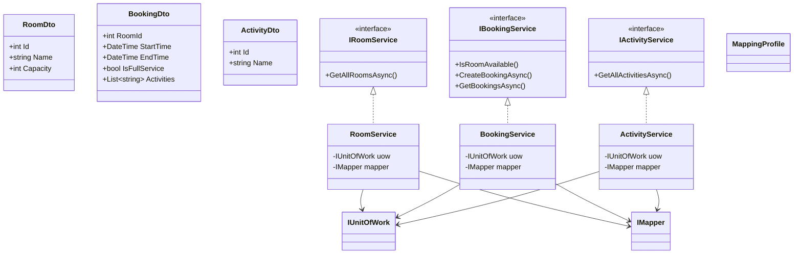
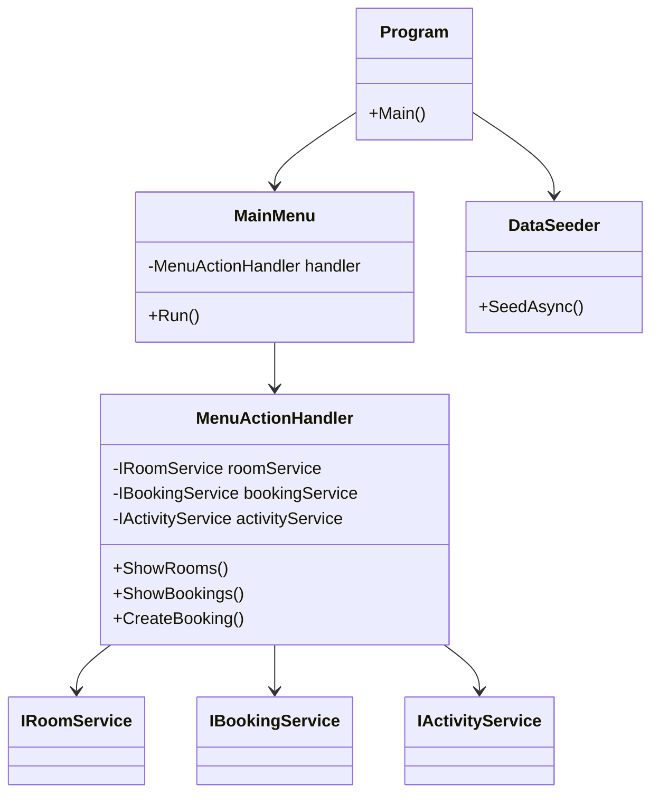

## Diagram 1. General Architecture (Layered)

```mermaid
flowchart TD
    PL[Presentation Layer - AntiCafe.PL]
    BLL[Business Logic Layer - AntiCafe.BLL]
    DAL[Data Access Layer - AntiCafe.DAL]
    DB[(Database)]

    PL --> BLL
    BLL --> DAL
    DAL --> DB
```
---
## Diagram 2. Data-Access-Layer

```mermaid
classDiagram
    class Room {
        +int Id
        +string Name
        +int Capacity
    }

    class Booking {
        +int Id
        +int RoomId
        +DateTime StartTime
        +DateTime EndTime
        +bool IsFullService
        +List~Activity~ Activities
    }

    class Activity {
        +int Id
        +string Name
    }

    class AntiCafeDbContext {
        +DbSet~Room~ Rooms
        +DbSet~Booking~ Bookings
        +DbSet~Activity~ Activities
    }

    class IRepository~T~ {
        <<interface>>
        +GetAllAsync()
        +FindAsync()
        +AddAsync()
        +Update()
        +Delete()
    }

    class Repository~T~ {
        -AntiCafeDbContext context
    }

    class IUnitOfWork {
        <<interface>>
        +IRepository~Room~ Rooms
        +IRepository~Booking~ Bookings
        +IRepository~Activity~ Activities
        +SaveAsync()
    }

    class UnitOfWork {
        -AntiCafeDbContext context
    }

    IRepository <|.. Repository
    IUnitOfWork <|.. UnitOfWork

    UnitOfWork --> Repository
    UnitOfWork --> AntiCafeDbContext

    Booking --> Activity
    Booking --> Room
```

---
## Diagram 3. Business-Logic-Layer

```mermaid
classDiagram
    class RoomDto {
        +int Id
        +string Name
        +int Capacity
    }

    class BookingDto {
        +int RoomId
        +DateTime StartTime
        +DateTime EndTime
        +bool IsFullService
        +List~string~ Activities
    }

    class ActivityDto {
        +int Id
        +string Name
    }

    class IRoomService {
        <<interface>>
        +GetAllRoomsAsync()
    }

    class IBookingService {
        <<interface>>
        +IsRoomAvailable()
        +CreateBookingAsync()
        +GetBookingsAsync()
    }

    class IActivityService {
        <<interface>>
        +GetAllActivitiesAsync()
    }

    class RoomService {
        -IUnitOfWork uow
        -IMapper mapper
    }

    class BookingService {
        -IUnitOfWork uow
        -IMapper mapper
    }

    class ActivityService {
        -IUnitOfWork uow
        -IMapper mapper
    }

    class MappingProfile {
    }

    IRoomService <|.. RoomService
    IBookingService <|.. BookingService
    IActivityService <|.. ActivityService

    RoomService --> IUnitOfWork
    BookingService --> IUnitOfWork
    ActivityService --> IUnitOfWork

    RoomService --> IMapper
    BookingService --> IMapper
    ActivityService --> IMapper
```

---
## Diagram 4. Presentation-Layer

```mermaid
classDiagram
    class Program {
        +Main()
    }

    class MainMenu {
        -MenuActionHandler handler
        +Run()
    }

    class MenuActionHandler {
        -IRoomService roomService
        -IBookingService bookingService
        -IActivityService activityService
        +ShowRooms()
        +ShowBookings()
        +CreateBooking()
    }

    class DataSeeder {
        +SeedAsync()
    }

    Program --> MainMenu
    MainMenu --> MenuActionHandler

    MenuActionHandler --> IRoomService
    MenuActionHandler --> IBookingService
    MenuActionHandler --> IActivityService

    Program --> DataSeeder
```
