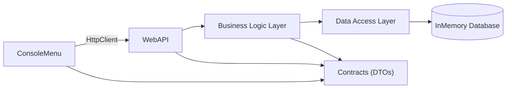
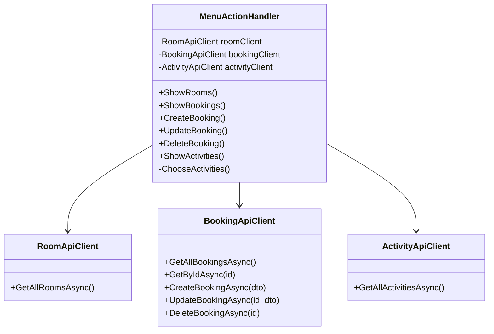
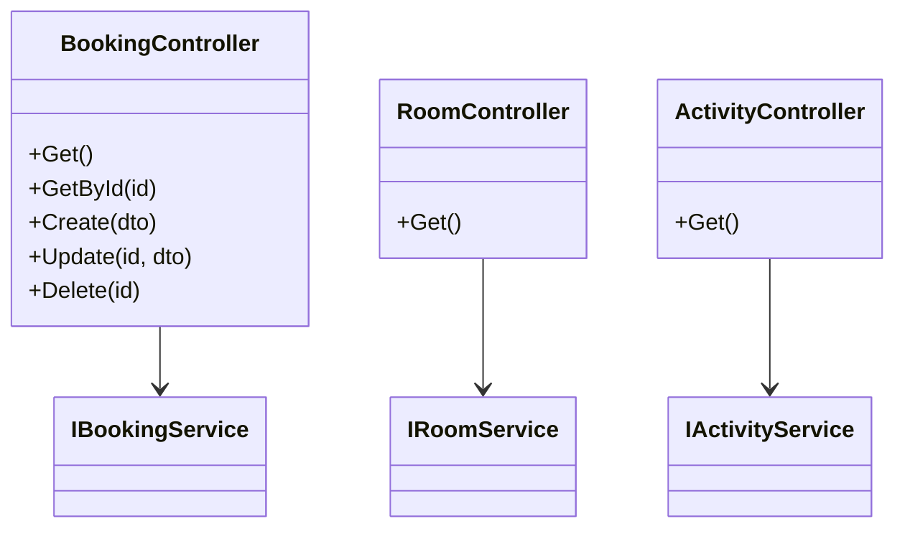
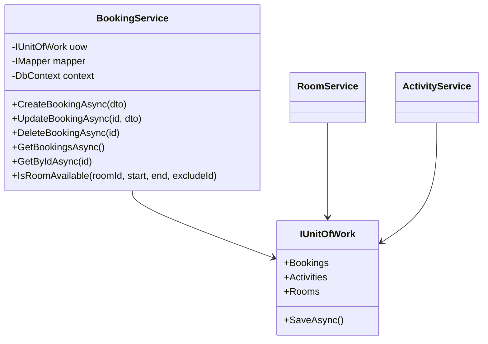
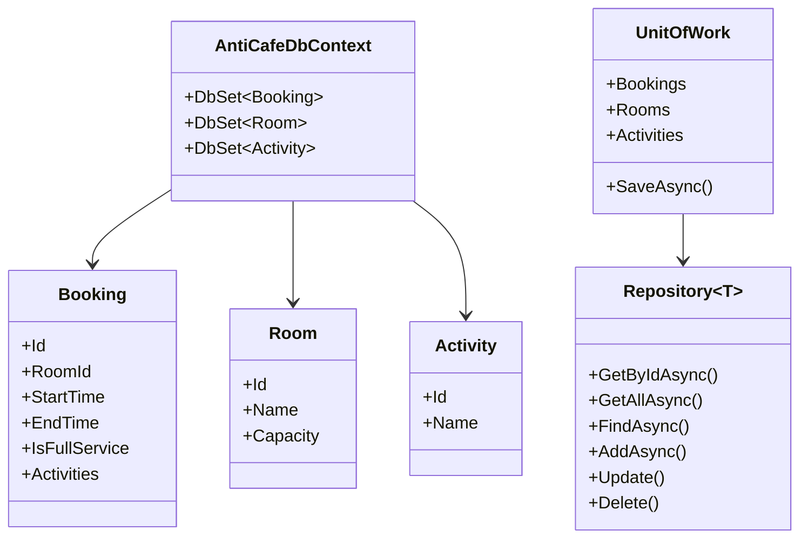
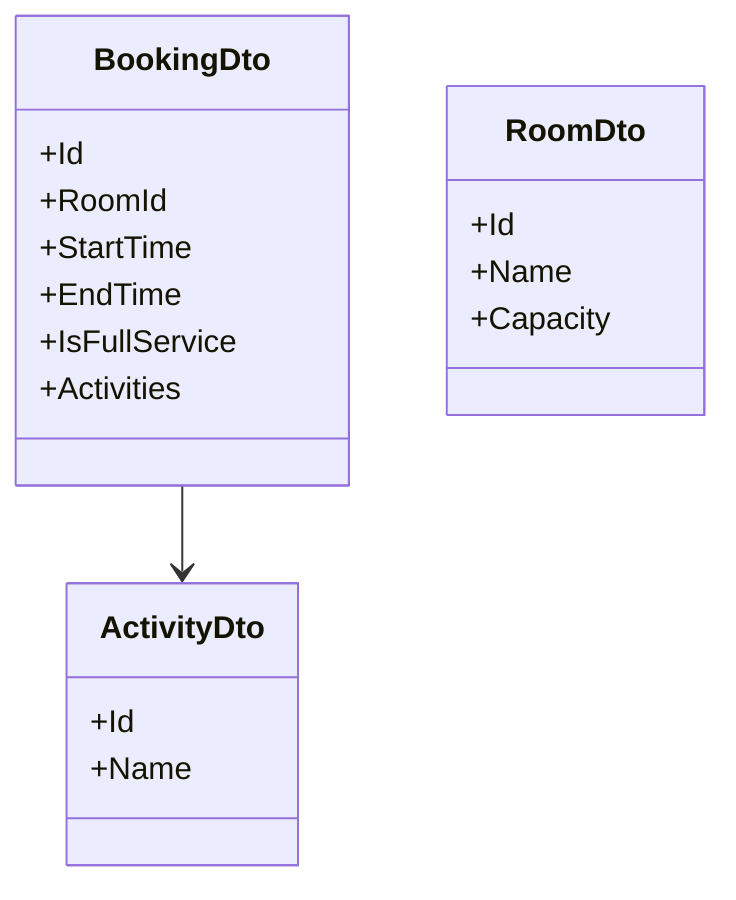

## Diagram 1. General Architecture (Layered)

---
## Diagram 2. ConsoleMenu

---
## Diagram 3. WebAPI

---
## Diagram 4. Business Logic Layer

---
## Diagram 5. Data Access Layer

---
## Diagram 6. Contracts (DTO)

